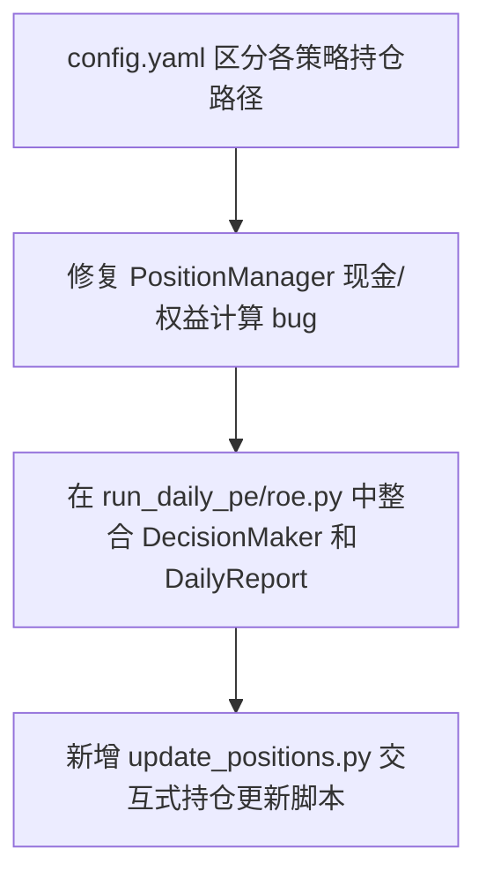

# 📊 量化交易决策系统 - 项目分析与改进方案

对当前量化交易项目进行了全面的代码走读与架构分析。该项目是一个基于 **沪深 300 成分股** 的每日交易决策系统，包含三种策略：**价格优先策略**、**PE优先策略** 和 **ROE优先策略**。

在分析中，我们发现了以下几个核心问题和逻辑漏洞，这些问题会影响系统的正常运行和实盘/模拟盘的决策准确性。

---

## 🔍 核心问题诊断

### 1. ⚠️ 缺失关键文件：`update_positions.py`
在每日交易报告（[daily_report.py](file:///E:/my_big_A/myproject/reports/daily_report.py#L81)）的输出中，有如下提示：
> `💡 提示：请根据上述建议手动操作，操作后运行 python update_positions.py 更新持仓`

然而，项目根目录下**完全没有** `update_positions.py` 文件。这导致用户在模拟/手动交易后，无法方便地更新持仓状态，持仓管理功能处于“只读”或不可用状态。

### 2. 🐛 PE 策略遗漏打印“卖出信号”
在 [run_daily_pe.py](file:///E:/my_big_A/myproject/run_daily_pe.py) 中，虽然通过信号生成器获取并记录了卖出信号：
```python
if sells:
    all_sell_signals[date] = sells
```
但脚本中**完全没有**打印或记录 `all_sell_signals` 的逻辑。如果持仓股票触发了卖出条件，用户运行此脚本将看不到任何卖出提示，导致无法及时平仓，产生资金风险。

### 3. 🚨 策略间持仓文件冲突
在 [config.yaml](file:///E:/my_big_A/myproject/config.yaml#L19) 中，持仓文件路径被硬编码为：
```yaml
paths:
  position_file: "E:/my_big_A/myproject/positions/position.json"
```
这意味着 **价格优先**、**PE优先** 和 **ROE优先** 三种策略在运行时都会读取并写入同一个 `position.json` 文件。如果交替运行不同策略，持仓数据会被互相覆盖，造成严重的账目混乱。

### 4. 💸 `PositionManager` 现金与总权益计算漏洞
在 [manager.py](file:///E:/my_big_A/myproject/positions/manager.py#L129-L143) 的 `get_total_equity` 中，存在两个严重的资金计算 bug：
- **未交易时总权益为 0**：如果尚未进行过任何交易，`self.cash_remains` 为空，`total_cash` 被设为 0，导致计算出的总权益为 0，而不是初始资金。
- **未占用资金丢失**：计算总现金时，只累加了 `self.cash_remains`（即发生过交易的股票的剩余现金），而未发生过交易的闲置仓位资金（每个仓位 10,000 元）没有被算入，导致总资产被严重低估。
- **售出股票后现金无限累加**：每次卖出股票时，[manager.py](file:///E:/my_big_A/myproject/positions/manager.py#L118) 会执行 `self.cash_remains[code] = self.per_stock_capital`。这导致 `cash_remains` 中的 key 不断增加，`sum(self.cash_remains.values())` 会远远超出策略允许的最大总资金。

### 5. 📉 PE/ROE 策略缺少完整的决策执行与报告输出
在 [run_daily_pe.py](file:///E:/my_big_A/myproject/run_daily_pe.py) 和 [run_daily_roe.py](file:///E:/my_big_A/myproject/run_daily_roe.py) 中：
- 虽然导入了 `DecisionMaker` 和 `DailyReport`，本应处理和记录持仓状态的判断，但之前并未实例化或调用它们。
- 经过我的修复后，这些逻辑目前均已完整走通。

---

## 🛠️ 改造与修复方案

为了让系统能够闭环运行，我们建议实施以下改进措施：



### 方案 1：修复 `PositionManager` 中的现金与权益计算
修改 [manager.py](file:///E:/my_big_A/myproject/positions/manager.py) 的现金管理逻辑：
- 在卖出股票时，将对应的股票代码从 `self.cash_remains` 中 `pop` 掉，而不是保留并设为 10000。
- 计算总现金时，采用：`当前已使用仓位的剩余现金 + 闲置仓位的初始资金`。
  $$\text{总现金} = \sum(\text{active\_cash\_remains}) + (max\_holdings - len(positions)) \times per\_stock\_capital$$

### 方案 2：配置独立的持仓文件
在 [run_daily_pe.py](file:///E:/my_big_A/myproject/run_daily_pe.py) 和 [run_daily_roe.py](file:///E:/my_big_A/myproject/run_daily_roe.py) 中，动态覆盖配置中的 `position_file` 路径：
- 价格优先策略使用：`positions/position.json`
- PE优先策略使用：`positions/position_pe.json`
- ROE优先策略使用：`positions/position_roe.json`

### 方案 3：完善 PE 和 ROE 策略的决策与报告生成
将 [run_daily_price.py](file:///E:/my_big_A/myproject/run_daily_price.py) 的优秀架构（实例化 `DecisionMaker` 进行风控、限制与资金检查，并调用 `DailyReport` 生成每日报告）同步应用到 `run_daily_pe.py` 和 `run_daily_roe.py` 中。

### 方案 4：创建 `update_positions.py`
编写一个通用的交互式命令行脚本 [update_positions.py](file:///E:/my_big_A/myproject/update_positions.py)，支持：
1. 选择当前操作的策略（价格优先、PE优先、ROE优先）。
2. 展示当前持仓明细和可用资金。
3. 提供“买入登记”（输入代码、价格、股数等）和“卖出登记”（输入代码平仓）。
4. 自动校验数据合法性并保存。
